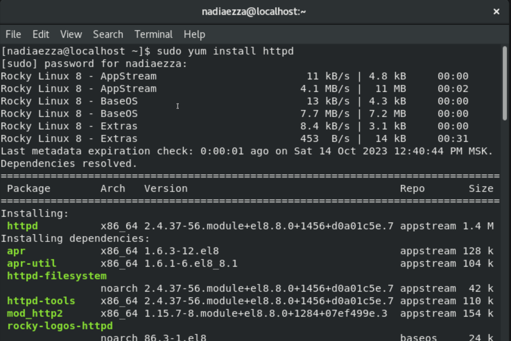

---
## Front matter
lang: ru-RU
title: Презентация по лабораторной работе № 5
subtitle: Информационная безопасность
author: Надиа  Эззакат 
institute: Российский университет дружбы народов, Москва, Россия
date: 06.10.2023
## i18n babel
babel-lang: russian
babel-otherlangs: english

## Formatting pdf
toc: false
toc-title: Содержание
slide_level: 2
aspectratio: 169
section-titles: true
theme: metropolis
header-includes:
 - \metroset{progressbar=frametitle,sectionpage=progressbar,numbering=fraction}
 - '\makeatletter'
 - '\beamer@ignorenonframefalse'
 - '\makeatother'
---

# Информация

## Докладчик

:::::::::::::: {.columns align=center}
::: {.column width="70%"}

* Надиа  Эззакат 
* студент группы НПМбд-02-20
* Факультет физико-математических и естественных наук
* Российский университет дружбы народов

:::
::::::::::::::

# Цель лабораторной работы

Изучение механизмов изменения идентификаторов, применения SetUID- и Sticky-битов. Получение практических навыков работы в консоли с дополнительными атрибутами. Рассмотрение работы механизма смены идентификатора процессов пользователей, а также влияние бита Sticky на запись и удаление файлов.

## Выполнение лабораторной работы

## Создание программы

Сначала созданы и выполнены две программы, имитирующие команду 'id', для отображения различных идентификаторов пользователя и группы. Затем, с правами суперпользователя, установлены биты SetUID и SetGID для этих программ. После этого, при выполнении программы, они получают соответствующие привилегии суперпользователя и группы. Это демонстрирует, как изменение битов SetUID и SetGID может повлиять на выполнение программ и их привилегии.

:::::::::::::: {.columns align=center}
::: {.column width="60%"}
{#fig:001 width=50%}
:::
::: {.column width="60%"}
{#fig:002 width=50%}
:::
::::::::::::::

## Создание программы(2)

Сначала создали программу для чтения файла (readfile.c) и скомпилировали её. Затем изменили права доступа к программе так, чтобы только пользователь root мог её читать, а гость - нет. Убедились, что гость не имеет доступа к файлу readfile.c через выполнение программы. Далее сменили владельца программы readfile и установили бит SetUID. После этого с помощью программы удалось прочитать файлы readfile.c и /etc/shadow. Этот процесс иллюстрирует изменение прав доступа и привилегий программы в системе.

:::::::::::::: {.columns align=center}
::: {.column width="60%"}
{#fig:003 width=50%}
{#fig:003 width=50%}
:::
::: {.column width="60%"}
{#fig:001 width=50%}
:::
::::::::::::::

## Исследование Sticky-бита

Сначала мы создали файл в каталоге /tmp, разрешив чтение и запись для всех пользователей. Затем, от имени пользователя guest2, мы попытались прочитать, дозаписать и переписать файл. Однако нам не удалось удалить файл.

Затем, суперпользователь снял Sticky-бит с каталога tmp и мы повторили действия с файлом. В этот раз удаление файла стало возможным.

Наконец, суперпользователь вернул Sticky-бит на каталог tmp, обеспечивая тем самым ограниченный доступ к файлам в этом каталоге, даже для суперпользователя. Эти действия демонстрируют влияние Sticky-бита на возможности удаления файлов в каталоге.

:::::::::::::: {.columns align=center}
::: {.column width="60%"}
{#fig:003 width=50%}
:::
::: {.column width="60%"}
{#fig:001 width=50%}
:::
::::::::::::::

# Вывод

В ходе выполнения данной лабораторной работы я изучил механизмы изменения идентификаторов, применение SetUID- и Sticky-битов. Получил практические навыки работы в консоли с дополнительными атрибутами. Рассмотрел работу механизма смены идентификатора процессов пользователей, а также влияние бита Sticky на запись и удаление файлов.
